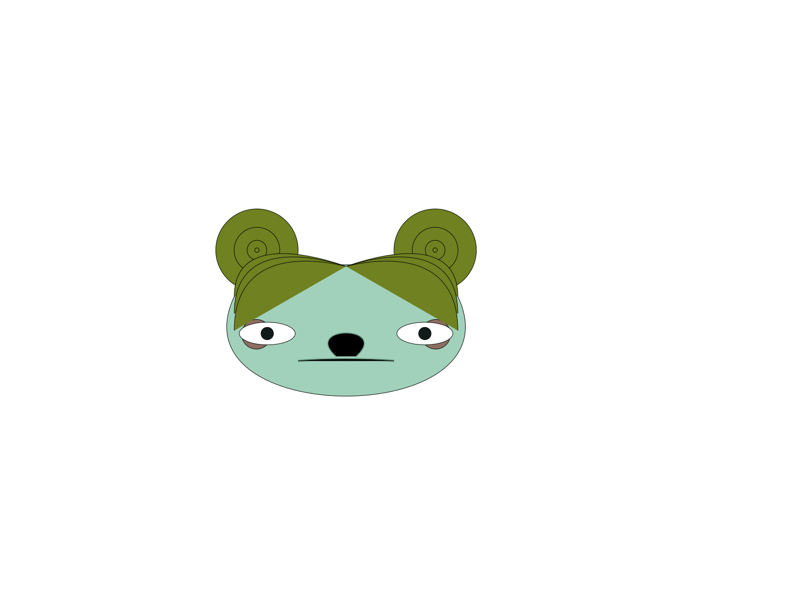

# svg_face

This is a straightforward port of https://github.com/anokhee/visual-synthesizer to Rust.

```rust
use rand::SeedableRng;

fn main() -> std::io::Result<()> {
    let mut rng = rand_xorshift::XorShiftRng::from_entropy();
    let mut file = std::fs::File::create("face.svg")?;
    svg_face::generate_face(&mut file, &mut rng)
}
```



To try it yourself, run `git clone https://github.com/dabreegster/svg_face && cd svg_face && cargo run --example aface`.
